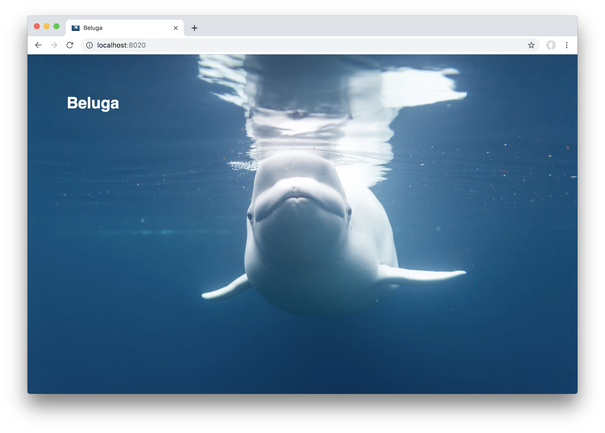

# Beluga

An application template using [Sanic](https://github.com/huge-success/sanic) and [React](https://reactjs.org/).

## Getting Started

The application is configured to run in [Docker](https://docs.docker.com/), building upon the Python 3.7 image. A [Makefile](Makefile) includes helpful commands to run and test the application.

### Installation

```bash
make build
make run
```

Once you've cloned the repository, build the Docker container for the application via `make build`. Building will install all required Python packages and Node modules.

Once the build is complete, run the application via `make run`. Preview it in your local browser at http://localhost:8020. The application will present a happy beluga when all goes well:



That's it! Now you are ready to transform this application template into your own app.

## Next Steps

Search this repository for "beluga" to quickly find starting points for customization.

Read on for additional information about the template's architecture and features.

## Architecture

### Back end

The entry point of the Sanic application is in _application.py_. There, the Sanic instance is initiated and configured to serve routes and static assets.

Routes are defined using a Sanic blueprint in _beluga/routes.py_. The index route (`/`) is configured to return a simple HTML file that renders a React app.

### Front end

The front end is served via Sanic's support for static directories. A bundle of assets prepared by webpack are stored in the `dist/` directory and exposed by the Sanic application.

The React application defined in _App.jsx_ is compiled by webpack into a _bundle.js_ script which attaches children to the `root` element in _index.html_. When a user visits the `/` route, they will see the React application rendered within the `root` element of the _index_ page.

## Command Reference

All commands run in the Docker container unless otherwise noted.

> Some commands run on the host (e.g. not in the Docker container) to improve performance. Consider using [a Python virtualenv](https://docs.python.org/3/library/venv.html#creating-virtual-environments) when running those commands to ensure that you are running Python 3.7.

### Docker

```bash
make build
```
Builds the Docker container and installs dependencies.

```bash
make run
```
Starts the Docker container and runs the application.

```bash
make kill
```
Kills the Docker container.

```bash
make destroy
```
Kills and removes the Docker container.

### Package Management

```bash
make pip_compile
```
Compiles python requirements.
> Note: does not actually install requirements; install them via `make build`.

> This command runs on the host.

```bash
make yarn
```
Updates node dependencies via [Yarn](https://yarnpkg.com/en/docs).

### Static Assets

```bash
make webpack
```
Runs webpack in ["watch" mode](https://webpack.js.org/configuration/watch/). As static assets are edited, webpack will watch for changes and recompile as needed. Updates will be visible in the browser upon reload.

## Testing

### Unit Tests

```bash
make pytest
```
Runs all Python unit tests using the pytest test runner. Pytest will automatically recognize any new tests so long as they conform to [the guidelines for test discovery](https://docs.pytest.org/en/latest/goodpractices.html#test-discovery).

### Style

```bash
make flake8
```
Runs a style check of Python code using [Flake8](http://flake8.pycqa.org/en/latest/manpage.html#description). Configure options in _setup.cfg_.
> This command runs on the host.

```bash
make eslint
```
Runs a style check of JavaScript code using [ESLint](https://eslint.org/) based on [the AirBnB style guide](https://github.com/airbnb/javascript). Configure options in _eslintrc.json_ and _.eslintignore_.
> This command runs on the host.
